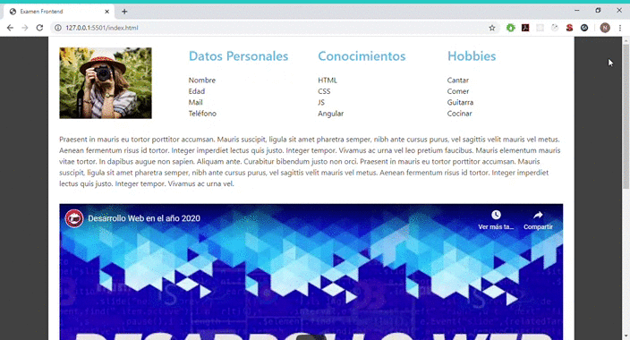
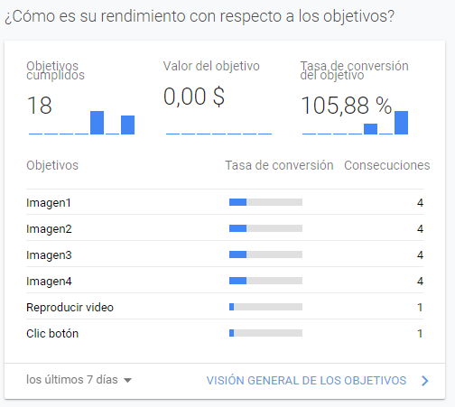

# 

> ### Examen de HTML, CSS Y JAVASCRIPT.

  

El repositorio debe contener el un archivo Readme explicando la implementación realizada y las observaciones que el postulante considere de utilidad sobre la decisiones que tomó para realizar las implementaciones.

# Explicación

### Estilos

- Aplique Bootstrap 4 para realizar la maquetación, provee de todas las reglas CSS para que el sitio web se adapte de manera dinámica a la mayoría de las pantallas.
    - col-xl-3: La clase col-xl-3 en cada columna, cada fila del diseño de dispositivo extra grande contiene 4 columnas.
    - col-md: Dispositivos medianos los que tienen un ancho de pantalla de 768 píxeles a 991 píxeles. En celulares (ancho de pantalla inferior a 768px), las columnas se    volverán horizontales automáticamente.
    - d-none: ocultar elementos para cualquier variación de pantalla.
    - d-sm-block: (hidden-xs)

### Javacript

- defer: Se descarga de forma asíncrona, en paralelo con el análisis HTML, y además su ejecución es diferida hasta que termine el análisis HTML. No hay bloqueo en el renderizado HTML. La ejecución de todos los scripts diferidos se realiza en el mismo orden en el que aparecen en el documento.
- UAParser.js: Biblioteca de JavaScript para detectar el navegador, el motor, el sistema operativo, la CPU y el tipo / modelo de dispositivo de la cadena de UserAgent.
- Fingerprint2: Podes elegir qué componentes incluir en la huella digital. Por ejemplo:  fuentes (Especifica una matriz de fuentes definidas por el usuario). Por defecto, la mayoría de los componentes están incluidos.
    -Utilice el preprocessor, función que se llama con cada valor de componente que se puede utilizar para modificar los valores de los componentes antes de calcular la huella dactilar. Además, tiene una función para crear una huella dactilar hash:
- Los datos almacenados en localStorage persisten hasta que se eliminan explícitamente. Los cambios realizados se guardan y están disponibles para todas las visitas actuales y futuras al sitio. Además, el tamaño disponible es de 5MB, que es considerablemente más espacio para trabajar que una cookie típica de 4KB.

## Tracking User

Use Google Analytics para la recopilación de los datos en las imágenes.

# 

**Imagenes:**

- Cuando vamos realizando el scroll las imágenes serán visibles, el valor isIntersecting nos indica si la imagen es visible o no. Una vez visible debemos desconectar el observable de la imagen ya procesada, debido a que la carga perezosa es una acción de una sola vez, no necesita descargar la imagen cada vez que detecte que es visible.

